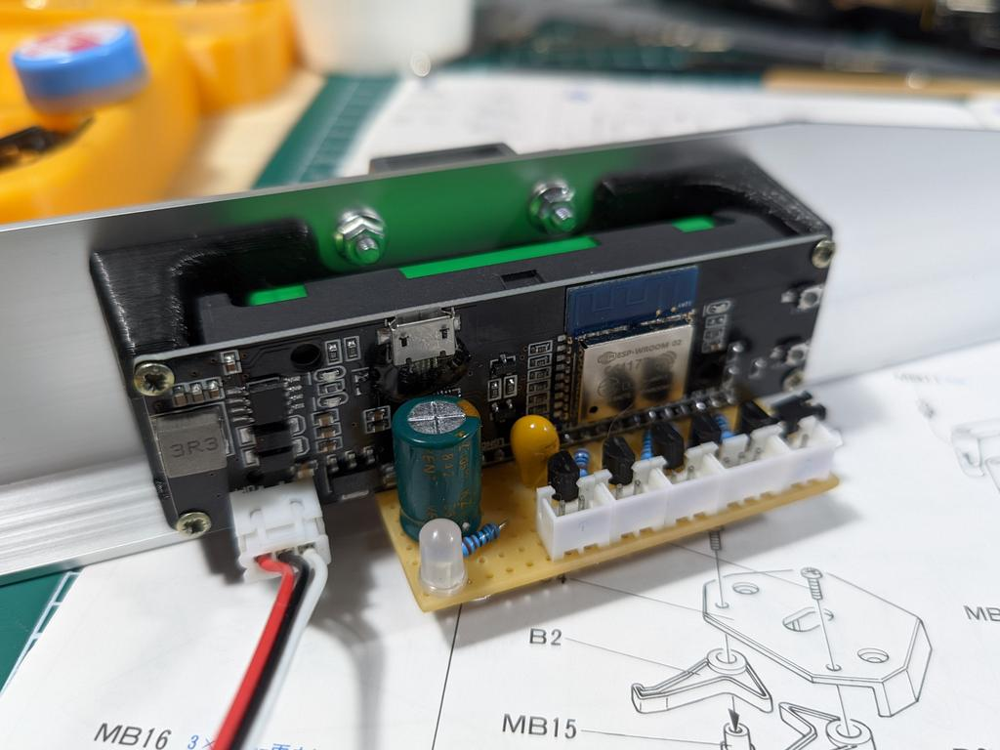

# Trailer for RC engine sound & LED controller for Arduino ESP8266

Based on the code written by TheDIYGuy999:

https://github.com/TheDIYGuy999/Rc_Engine_Sound_ESP32

**(You need one of those Engine Sound and Light Controllers to use this sketch!)**

This sketch is for a ESP8266 (NodeMCU DevKit or similar), to switch the lights on a trailer, according to the data received via ESP-NOW, from the ESP32 main controller (usually mounted on the truck).

Please note, that this sketch does NOT support connecting servos or ESCs (for legs, ramps, winches), only lights/LEDs! Single LEDs may be powered by the MCU directly, but it is recommended to use some NPN transistors to switch them.

Pressing the "Flash" (or "Boot") labeled button on the dev kit PCB, will cycle through all lights which each press and then return back to receiving ESP-NOW data.

The trailer presence switch, if open, disables WiFi/ESP-NOW and the LEDs entirely until, coupled (switch closed).
Remember to bridge the contacts if there isn't a switch on your trailer or you don't want to use one!

